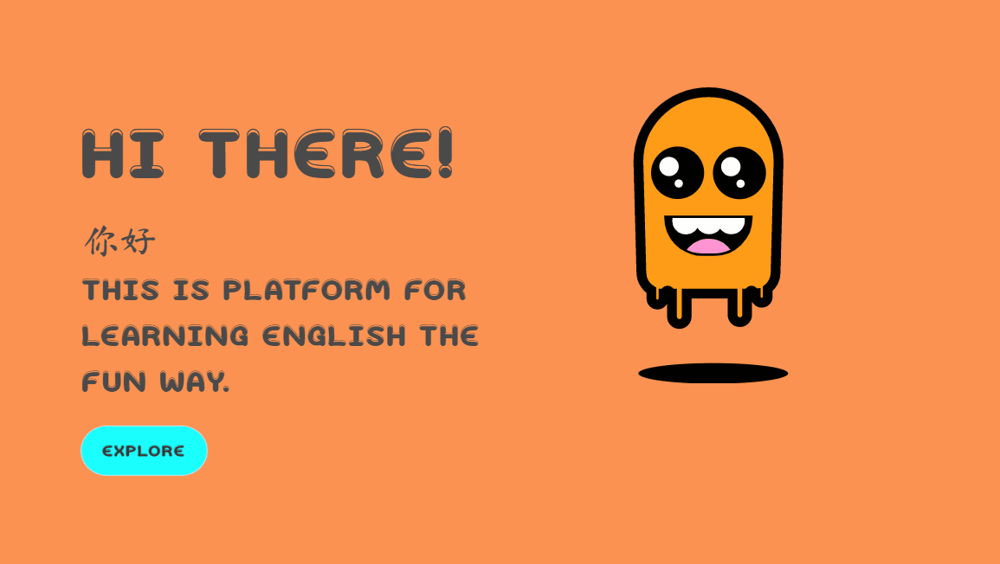
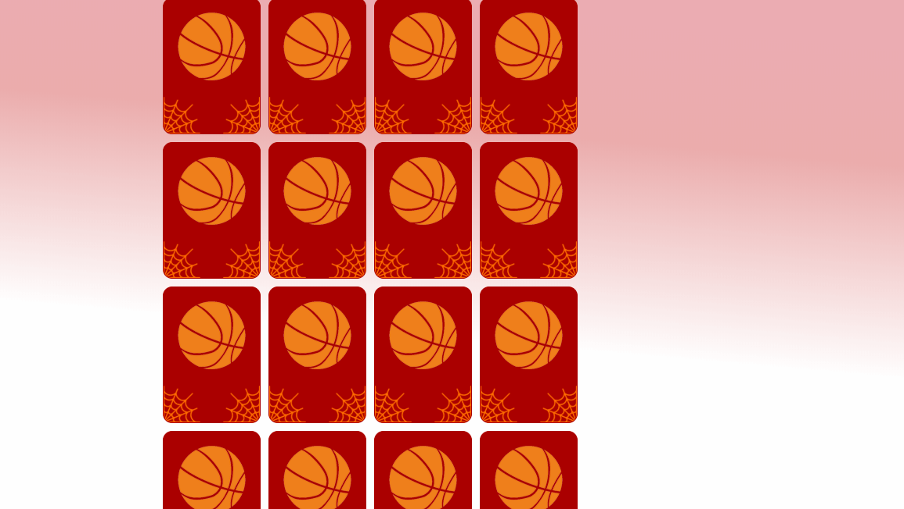

# ESL Electron Application Demo



## Getting Started

To get started clone the repo
```bash
git clone https://github.com/Codzaa/ESL_ElectronApp.git

cd ESL_ElectronApp

npm Install
```

### Start Application
```
npm start
```
This is an Electron Application centered around the ESL(English Second Language) idea/concept. It includes a Demo game based on matching a Picture and a word.


